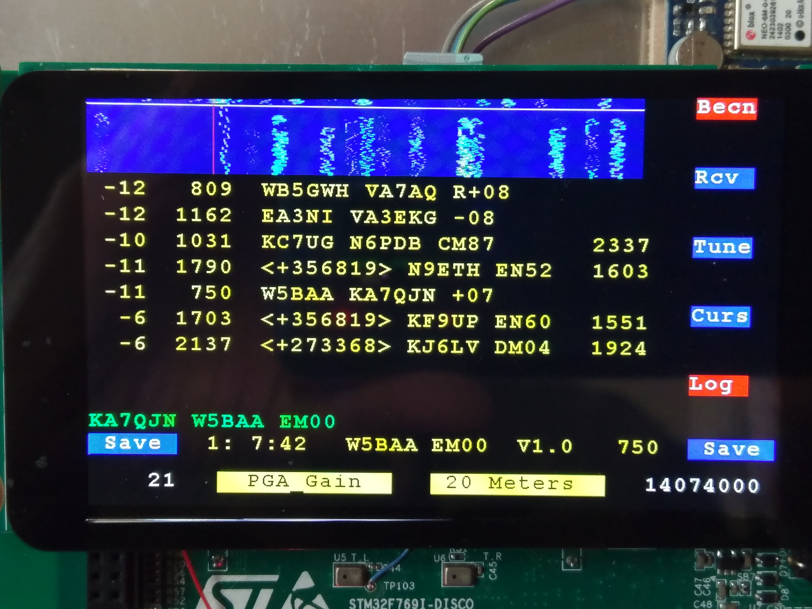
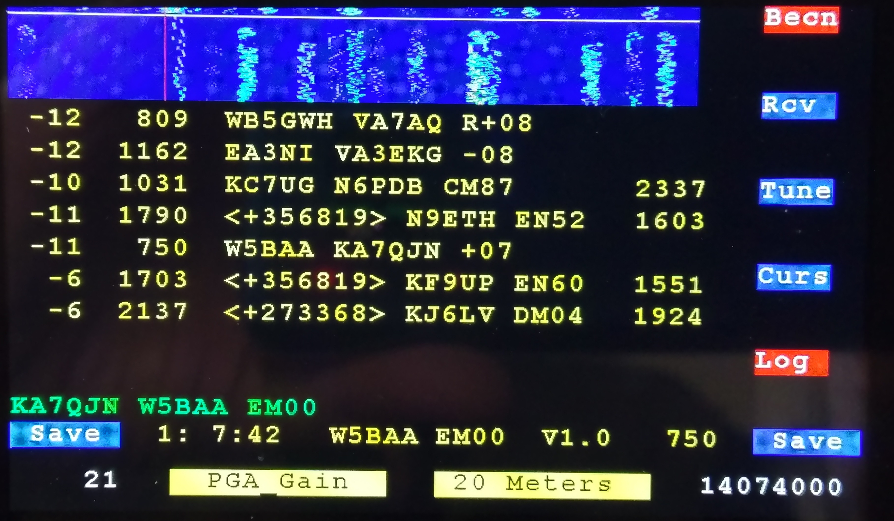

__Project Motivation, Attribution and Other Thoughts December 2019__

For the past ten years after retiring I have had a lot of fun building ham radio projects which utilize microprocessors to perform DSP for SDR radios.  Past projects include the SDR2GO, STM32-SDR and STM32F746_SDR. As part of the  STM32F746_SDR project I included a Beaconing feature that uses a GPS receiver to periodically send a PSK call along with location latitude and longitude. Over time I noticed that the number of stations monitoring PSK traffic using PSK Reporter has significantly dwindled due to rise in popularity of FT8 operation.

So, during the Summer of 2019 I started a quest to do FT8 on a STM746 Disco board. This did not turn out well due to my code using more RAM than is easily available on the STM746 Disco Board. I gave up several times in frustration.

In one of my restarts of this project I came across the work done by Karlis Goba which you may review on this website: https://github.com/kgoba/ft8_lib . Karlis is a ham, YL3JG. And, I decided to port my previous FT8 work over to the STM769 Disco board which has a lot more RAM than the STM746 Board. ShaZam  I finally got the FT8 stuff to work! Not only does iit work, it works well due to the great work done by Karlis. I have had several email exchanges with Karlis and he has been most helpful and supportive in my effort to produce another DSP project.

At, present the operating mode of the application is quite limited. However, as I learn more about FT8 operations and experiment with the code I will probably add additional operation modes and features.

__Time Synchronization__

One of the main items that I learned from Karlis is that it is quire easy to synchronize the application in time without relying upon a GPS clock. To do this, we set up an internal clock in software with millisecond resolution to create what I call FT8 Relative Time. This clock is synchronized by simply watching the waterfall and depressing the Blue User Button on the STM769 board during the lull in FT8 traffic. My experience is that FT8 application will remain synchronized for hours using this method.

__Simple Operating Mode__

So, when the Becn Touch Button is red the application monitors the FT8 Relative Time clock and will issue an FT8 CQ that includes your Call and Maidenhead Locator when the clock reports 00 seconds. The application then monitors the FT8 traffic and searches for your Call at the beginning of each FT8 decode. When if finds the first decode with your Call, it composes an FT8 reply that includes the responding station Call, your Call and your  Maidenhead Locator. This reply is then transmitted when the next 00 seconds is reported. At the end of this FT8 transmission, the Becn is reset to issue another CQ on the next 00 second interval.

__Here is a photo of the Display Showing a Reply Message in Green at the very Bottom.__

__And, here is an extract from the FT8 message Log file.__

W5BAA KA7QJN +07

KA7QJN W5BAA EM00

W5BAA AB6OR DM13 

AB6OR W5BAA EM00

W5BAA W4LRN EM90 

W4LRN W5BAA EM00

W5BAA W4LRN EM90 

__And, here is a report of FT8 Station Receiving My Signal from a 5 Watt SDR Radio using the application.__

